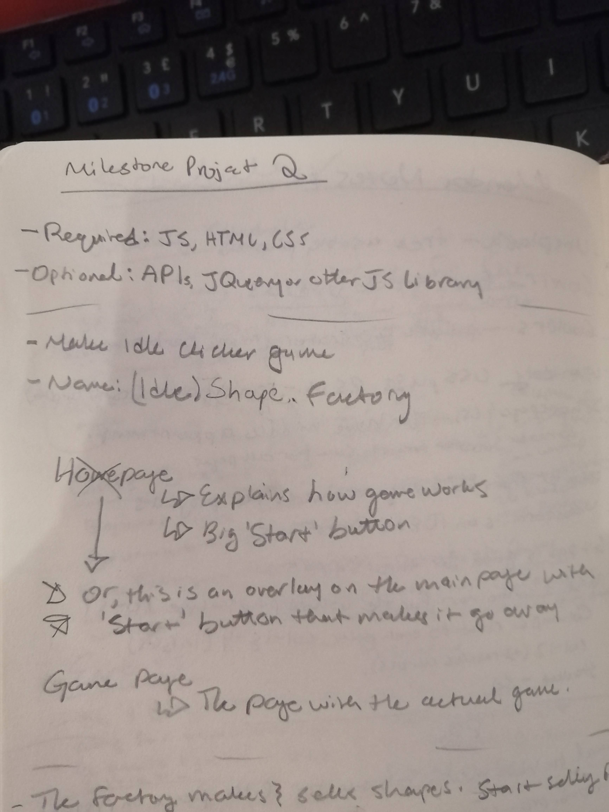
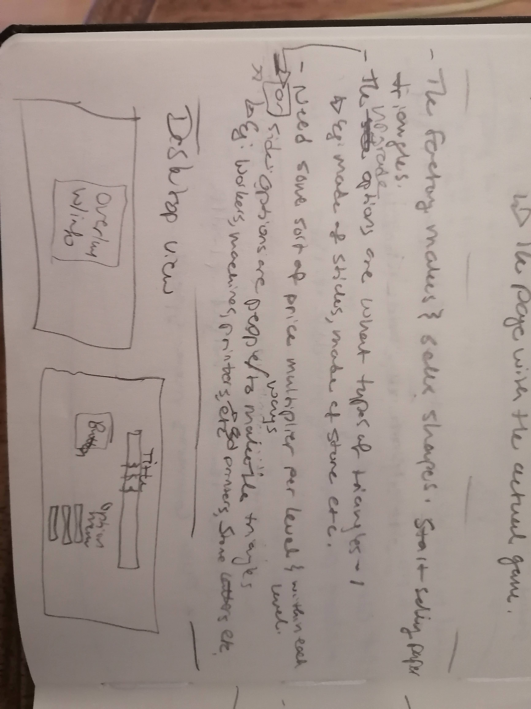
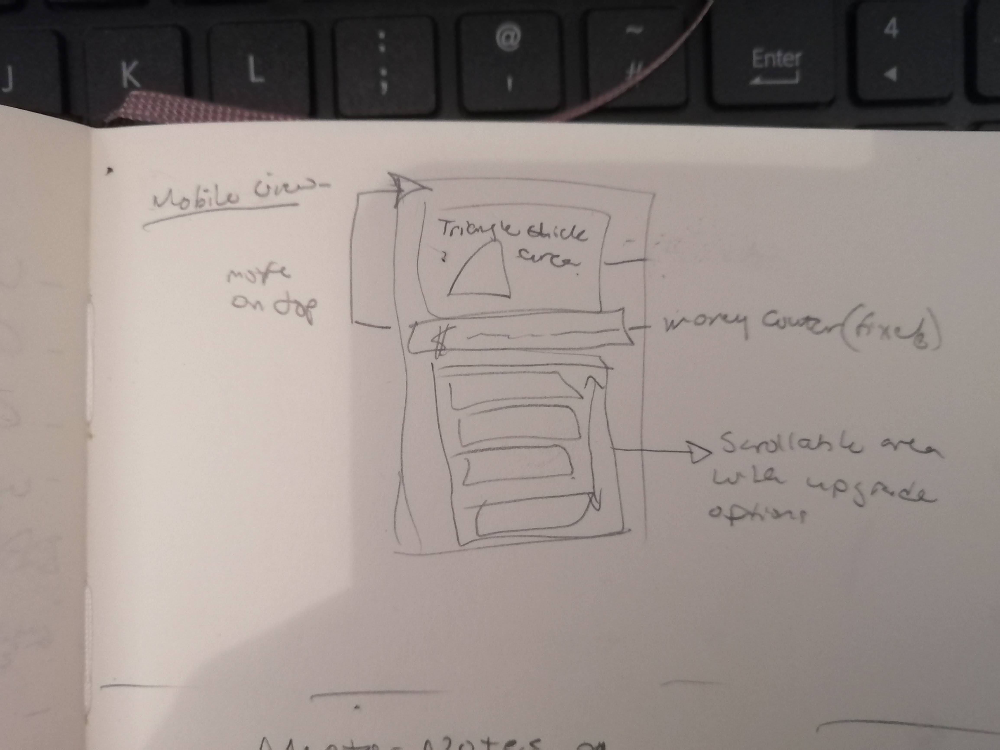
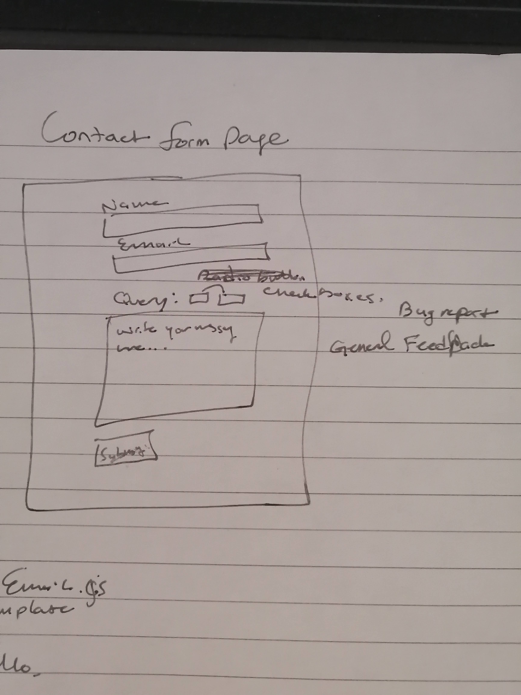
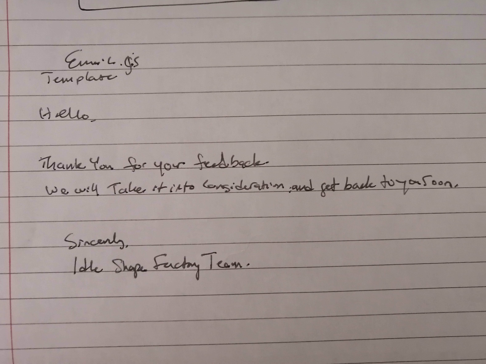
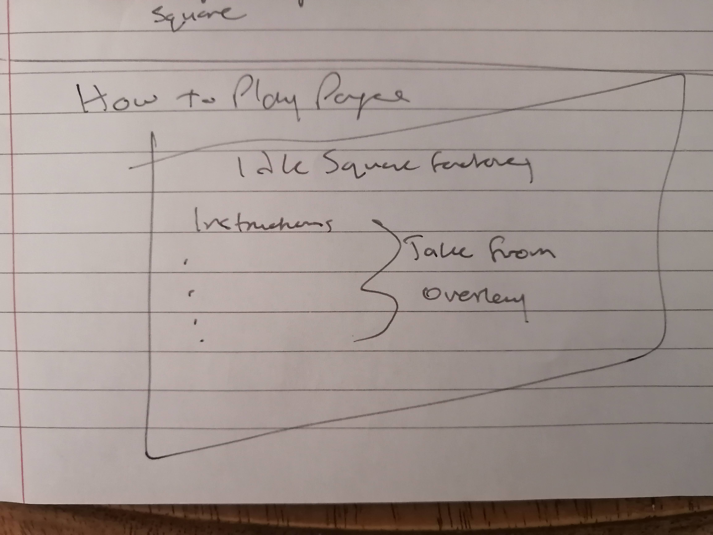

# Idle Square Factory

* [Link to deployed website](https://phoebeireland.github.io/codeinstitutemilestoneproject2/)
* [Link to github repository](https://github.com/phoebeireland/codeinstitutemilestoneproject2)

# Contents

1. UX
2. The Website
3. Testing the Site
4. Deployment
5. Credits

# UX

## The Project- Purpose and Buisness Goals

The purpose of this website was to create an idle clicker game. The webpage should both be a platform for the game as well as provide information for users on how the 
game is played. 

On the business end, the website should be simple nough to use for new users, while still offering enough content and variety for returning users. Furthermore, returning users should
have the option to carry over their scores from previous sessions, so they do not have to start over every time that they enter the game. 

## User Stories
As a New User to the site, I want:
1. To be able to learn how to play the game easily
2. Easily accessed buttons and clearly displayed money total
3. A fun looking game with engaging colours

As a Returning User to the site, I want:
1. To be able to keep my score from the last time I played
2. A game that is easy to navigate
3. An easy way to remind myself how to play the game 
4. A way to contact the creator of the game to report any issues or submit any ideas for improvement

## Design Choices

The overall feel of the game should be fun and colourful. The game is fairly simple, so the colours chosen and fonts used should add to the experience of playing the game
and lend a hand in keeping the users engaged with the website. All of the parts of the game should be labeled clearly and inform the user of their purpose. 

### Font

The fonts used on the game are Source Sans Pro and Abril Fatface. Both of the fonts were found on Google Fonts. For the majority of the text on the web-page, including the overlay, the font Source Sans Pro was used. For the title of the game, at the top of the page, Abril Fatface wsa chosen. The reason behind using two separate fonts is that overall, the website should be easily readable and understood, so Source Sans Pro was the clear choice due to its clean lettering and easy readability. However, to further enforce the "fun" aspect of the game, Abril Fatface was used in the title of the game at the top of the page. It is only used there due to the fact that it is slighty harder to read, so using it across the entire page would not have been ideal.

### Colours

The main colours used on the site are:
* rgba(99, 95, 95, 0.4) for the background of the overlay.
* 0E79B2- HEX for the colour of the large button
* F0A868- HEX for the background colour of the main page
* 7BD389- HEX for the colour of the Score bar
* The default button active/inactive colour for the Upgrades buttons as dictated by Bootstrap.

The colour scheme for the game was created using Coolers. 

### Styling

The overall look of the game page is fairly simple. Centered on the page towards the top are the game name and the score area, and below are two columns containing the large click-box and the upgrades area, each in its own div element. Below both of those elements is the "Save Score" button. As the website relies heavily on the JavaScript code to run the game, the User Interface was deliberately designed to be on the simpler side. For this particular game, it felt more necessary to focus on the JavaScript Code that would run the page, rather than on inserting a lot of fancy icons and images that would ultimately be distracting for the user and possibly complicate the process of playing the game. In the end, the game has a simple concept, and it felt appropriate to keep the UI simple to reflect this.

## Wireframe Designs
The Wireframe designs were created in a notebook using a pencil, and the following images are photos taken from the notebook. As they are handwritten, some of the writing may not be fully legible to all readers. To combat this, I have added a typed description of all pages below the image. Please refer to those if needed.  

Please keep in mind that the drawings were the first stage of the design. and the actual website may look somewhat different from the drawings. Where the two differ, I offer an explanation as to why. 

### The Project Overview 

This image shows the general requirements for this project as the top. Below is the layout plan of the pages for the project.

### Game Description and The Desktop View

This image shows the idea behind the idle clicker game  as well as the proposed desktop view for the game. 

### The Mobile View

This image shows the plan for the mobile view for the game. In this image, all of the items are to be stacked on top of one another. In the final product, the money bar was moved to the top of the page (under the game name) and it is not fixed. 

### The Contact Form Page

This image shows the plan for the contact form page. In this image, all of the items are able to be stacked on top of each other and scale down to fit the size of the screen.

### The Email Template Idea

This image shows the plan for the email template to be sent by EmailJS. This is the email that will be sent to whoever sends a feedback form.

### The How to Play Page

This image shows the plan for the How to PLay page. It is basically a reiteration of the rules on how to play the game that is displayed on the overlay. It felt necessary to reiterate those instructions elsewhere on the site. 

# Features
* Every page has the game name at the top of the page as well as the Navbar.
* On smaller screens, the elements will stack on top of each other.

### The Homepage
* When the game initially loads, there is an overview with the instructions on how to play the game on top of the ggame page.
* When the game first loads, the upgrade buttons are all disabled, and are only enabled when the required money target is reached. 
* There is a save button underneath the clicke box that can be used to save the current game score in a cookie. 
* On smaller screens, the elements will stack on top of each other, with the score bar on top. 
* In desktop view, the clicker box and the upgrade menus are side by side.

### The How to Play Page
* When the page loads, the instructions are loaded as a list.
* On smaller screens, the list of instructions scales to fit.

### The Contact Page
* When the page loads, the form is loaded across the page.
* On smaller screens the form scales down and fits thte size of the screen. 
* There are multiple input boxes for users to enter their name and email address into the form, as well as a box for written comments.
* There are two checkboxes for users to indicate which type of feedback they are submitting.
* There is a large textbox area for the user to submit a written message.
* There is a submit button for the user to use to send their message to the website. 
* The submit button is linked to EmailJS and sends an Auto-Reply to the sender of the email to the email address that they provide.

# Testing the Site

All HTML pages and CSS files were tested using the HTML and CSS Validator from W3.
* Link to the [HTML Validator](https://validator.w3.org./) used
* Link to the [CSS Validator](https://jigsaw.w3.org/css-validator/) used

## Manual Testing

Using the Chrome Inspect tool, the following aspects of the website were tested:
* All of the contents of the page collaped and stack on top of each other when viewed on smaller screens.
* The text on the page and the overlay are easily read on all screen sizes. 
* The buttons and the clicker box all scale down when viewd on smaller screens.
* The overlay scales down with the smaller sized screens and the yellow background is always behind to text.
* The various text elements are all centered when scaled down on smaller screens.

The EmailJS extenstion was tested using a sample email address and sample message.
* The result of this test was that the EmailJS service sent an email to the connected email address saying that a message was submitted.
* Also, an Auto-Reply email was successfully sent to the email address provied in the form. 

## Testing User Stories
### New User:
1. Upon entering the site initally, the user is greeted by an overlay that goes step-by-step through the instructions on how th egame works, and how to play. Once through with reading the instructions, the user can click on the overlay, or elsewhere on the screen, and begin to play the game. If a refresher of the instructions is needed, a player need only look to the navbar at the top of the page and click on the How to Play section to be brought to a page that restates the instructions provided on the initial overlay. 
2. The main elements on the main game page are the various buttons and the money score area at the top of the page. All of the buttons are clearly labeled, with the functions of the button either immediately available upon a glance or, once the button has been unlocked, available by simply hovering the cursor over the button. 
3. Although the game itself is fairly simple, the colours chosen for the game are bright and playful and engaging. Each different aspect of the game- the buttons, the score area, the navbar- has its own colour that distinguishes it from the other elements, while still keeping a cohesive colour scheme. 

### Returning User:
1. At the bottom of the page, there is a Save Score button. In the instructions provided on both the inital overlay and on the How to Play page, it states clearly that in order for a user to save their current score upon exitiing or reloading the website, they must first press the Save Score button. A further confirmation of the current saved score pops up once the user has clicked the button.
2. The Navbar is clearly at the top of the page, and the different sections- Home, How to Play and Contact Us- are all clearly visible and easy to click on to nagivate to the desired page.
3. The game always presents the guidelines for how to play the game when the page is initially loaded, as well as any time it is refreshed or reopened. In addition, there is the ability to use the navbar to go to a page that also clearly optlines the rules of the game. 
4. Located in the Navbar, the third option takes the user to the contact form in which they are able to submit a comment or suggestion regarding the website. The form is straightforward and easy to navigate. All the user needs to submit is their name, email and comment typed into the provided text box. The form is linked to EmailJs, so when it is submitted, an email is sent to the website email, and another email is sent to the email address provided confirming that their comment or suggestion was submitted. 

## Small Problems (that were fixed)
* One the smallest screens, the yellow box in the overlay was not behind all of the text, which made the instructions on the overlay somewhat difficult to read. This was fixed by manually setting the size of the background box to a larger size that would surround the text on all screen sizes. 
* The main clicker box had slight sixing issues when viewd on smaller screens, but it was fixed but altering the width and height dimensions in CSS.
* Fixed the score so it reads to 2 decimal places rather than just one using the .toFixed() method. The code for that method was found [here](https://www.w3schools.com/jsref/jsref_tofixed.asp). 
* On my laptop using Google Chrome, the cookies wouldn't display, so I had to make a python server to test to make sure that the cookies were functioning properly. The instructions to make the python server were found [here](https://developer.mozilla.org/en-US/docs/Learn/Common_questions/set_up_a_local_testing_server). Once the server was made and the page was opened within the serve, I was able to see that the cookies were indeed working as they ought to be (ie, saving when the save button was pressed, and loading when the screen was reloaded).
* Had some issues connecting Emailjs functionality to the form I had made. Fixed it by looking at the sample code on the EmailJs site and matching up the missing pieces to my code. I had created the form on its own initially, so when it came time to connect EmailJS to the form, it presented with some issues. This was fixed by renaming some of the elements and making sure that the elements had the correct IDs and names.

# Deployment
The Website was created in Visual Studio Code, version controlled with Git and hosted on Github. 

This website has been deployed to GitHub Pages- [link to website](https://phoebeireland.github.io/codeinstitutemilestoneproject2/)

Steps to publish website to GitHub Pages:
1. On the main page of the repository, click settings.
2. Go to the GitHub Pages section on the menu bar to the left.
3. In the Source section, click "None" and change the selected branch to "main". 
4. Leave the following option as (root), and click "Save"
5. Once the repository is published, a link to the website will be shown in the GitHub Pages section. 

To Clone this repository using IDE Terminal:
1. Navigate locally to the directory in which you want to save the repository.
2. On the main page of the repository, click the "Code" button, and copy the HTTPS address.
3. In the terminal, run the command: 'git clone' followed by the HTTPS address.
4. The project will now be saved to the desired directory. 

To Clone this repository using Visual Studio Code:
1. Open a new window in VSCode.
2. On the main page of the repository, click the "Code" button, and copy the HTTPS address.
3. Back in VSCode, under "Start" click "clone repository" and paste the link into the textbox that pops up.
4. Navigate into the folder that you want the repository to be saved into, and "Select Repository Location".
5. The repository will now be saved to the selected location.

# Credits

Created by Phoebe Ireland

The content of this website was created by Phoebe Ireland, with the exception of the following:
* [Google Fonts](https://fonts.google.com/)
  * Used to apply the Source Sans Pro font and Abril Fatface to all pages
* [Coolors](https://coolors.co/)
  * Used to create the colour scheme for the game.
* [Bootstrap](https://getbootstrap.com/)
  * Used to create the Upgrade Buttons
  * Used to create the Navbar
  * Used to help create elements of the contact form
* [jQuery](https://jquery.com/)
  * Uses jQuery for the overlay and the hover ability on the upgrade buttons.
* Code Institute's Love Maths Project
  * Used to figure out how to display and calculate the score.
* [StackExchange](https://stackexchange.com/)
  * Used to figure out how to make the cookies work.
* [StackOverflow](https://stackoverflow.com/)
  * Used to find the jQuery code for the overlay. 
* [Emailjs](https://www.emailjs.com/)
  * Used to connect the contact form to an email service.
* [Bootswatch](https://bootswatch.com/)
  * Used to add new styles to the Bootstrap elements

   All of the content that was taken from other sources was altered to fit the use of this website where necessary.

A special thank you to my mentor for helping me though the project, and pointing out my (numerous) mistakes. 